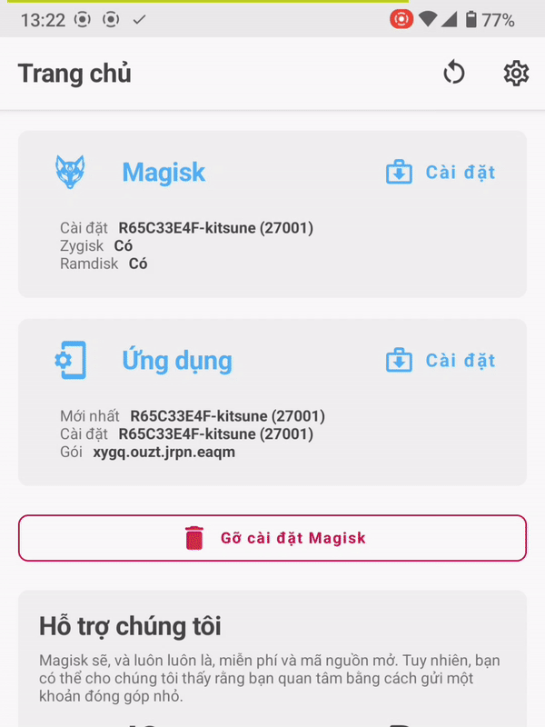
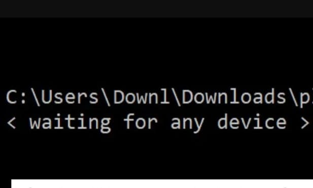
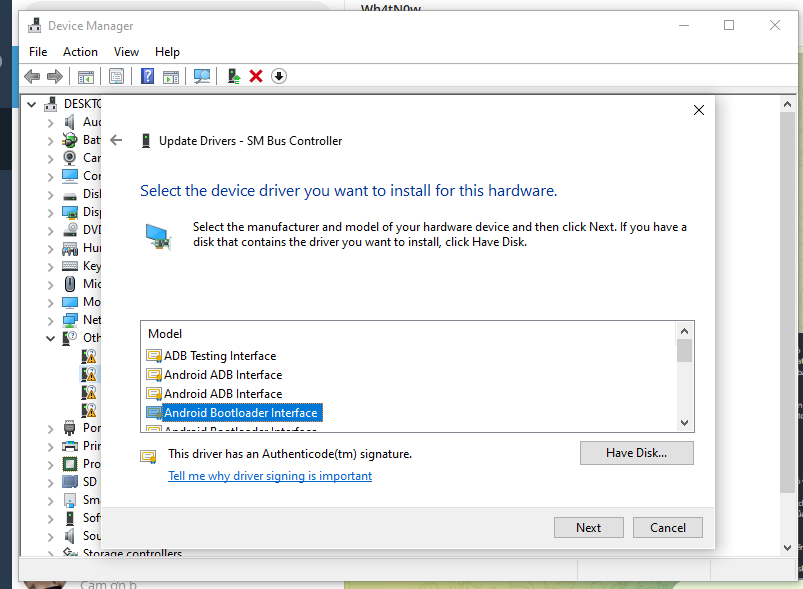
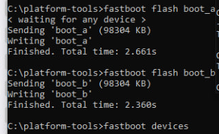

# LG V50s ThinQ 5G
# Unlock Bootloader
- Bật OEM trong chế độ nhà phát triển

  
- Kết nối cáp từ điện thoại vào máy tính. Sau đó giữ nguồn và giảm âm lượng cho đến khi màn hình đen.
- Khi màn hình tắt đi, vẫn giữ Nguồn và giảm âm lượng, và đồng thời bấm tăng âm lượng liên tục.

  
- Trong Device Manager sẽ hiển thị QHSUSB_BULK hoặc Qualcomm HS-USB QLoader 9008(COMx) 

- Mở QFIL lên sau đó ở Sellect Build Type chọn Flat Build, ở Storage Type chọn ufs, Patch Programer chọn file .elf
  
- Chọn Tool chọn Partition Manager tìm abl_a và abl_b sau đó chọn ReadData... để backup

  
  
  
- Mở File Explore đường dẫn C:\Users\Username\AppData\Roaming\Qualcomm\QFIL\COMPORT# sau đó đổi tên ReadData_ufs_Lun4.bin thành abl_a.bin và tương tự abl_b cũng vậy

  
- Làm tương tự với boot_a và boot_b. Boot_a và Boot_b dành cho Magisk Root. Bỏ qua nếu bạn chỉ muốn Mở khóa Bootloader.
- Quay lại Partition Manager tìm abl_a sau đó chọn LoadImage... chọn file abl_a.bin G8X đã chuẩn bị sẵn (không phải file vừa backup) làm tương tự với abl_b
  
- Đóng Partition Manager và đợi 1 chút khi bảng STATUS hiện Finish Reset To EDL
  
- Cắm cáp giữ nút giảm âm lượng và nút nguồn tầm 7 giây thì máy khởi động lại, khi màn hình tắt thả 2 nút ra sau đó nhấn giữ nút giảm âm lượng để vào Fastboot
  
- Mở CMD sau đó nhập lệnh cd C:\Folder_của_Fastboot
- Sau đó nhập lệnh **fastboot devices** nếu hiện LMG850UM fastboot thì máy đã nhận fastboot
- Nhập lệnh **fastboot oem unlock**
- Dùng phím giảm âm để di chuyển đến dòng UNLOCK THE BOOTLOADER sau đó ấn nút nguồn là thành công

# Root bằng Magisk
- Mở Windows Explorer và truy cập C:\Users\Username\AppData\Roaming\Qualcomm\QFIL\COMPORT#
- Chuyển boot_a sang điện thoại của bạn .bin hoặc boot_b.bin mà bạn đã sao lưu trong thư mục COMPORT#.

- Tải xuống và cài đặt Magisk hoặc Kitsune Mash.
- Mở Magisk và bên cạnh Magisk nhấn "Cài đặt" rồi "Chọn và vá tệp" và chọn boot_a.bin hoặc boot_b.bin.

- Sau khi Magisk vá img boot của bạn, bạn sẽ nhận được file magisk_patched#####.img trong thư mục Tải xuống của điện thoại và Chuyển nó sang thư mục fastboot trên PC của bạn.
- Khởi động điện thoại vào chế độ Fastboot
- Nhập lệnh vào cmd fastboot trên máy tính **fastboot flash boot_a magisk_patched#####.img** và **fastboot flash boot_b magisk_patched#####.img**
- Nếu CMD hiển thị <waiting for any device>

  

- Vô Device Manager kiểm tra  Other Devices có mục Android có hình tam giác vàng, chuột trái chọn Update Driver => Browse My Computer For Devices => Let Me Pick From A Lits....... => Android Device => Android Bootloader Interface => Next => Finish

  

- Như hình là thành công

  

Khởi động lại Hệ thống bằng cách giữ âm lượng và nguồn cho đến khi điện thoại của bạn tắt màn hình, sau đó thả tay ra.

# Cài ROM GSI

cài trước rom base 

adb reboot fastboot

fastboot flash boot_a C:\Users\Admin\Desktop\a\boot_OFOXRECOVERY.img && fastboot flash boot_b C:\Users\Admin\Desktop\a\boot_OFOXRECOVERY.img

adb sideload C:\Users\Admin\Downloads\DerpFest-11-mh2lm-20230309-0419.zip

vào lại recovery của ROM vừa flash, sau đó up lại rom lần nữa

wipe data

khởi động hệ thống đầy đủ

GSI

adb reboot fastboot

fastboot --disable-verity --disable-verification flash vbmeta C:\Users\Admin\AppData\Roaming\Qualcomm\QFIL\COMPORT_15\vbmeta.img

fastboot flash system C:\Users\Admin\Downloads\ProjectSakura\ProjectSakura_A14-RO-arm64-bgN-slim_20240521.img

fastboot flash boot C:\Users\Admin\Desktop\a\boot_OFOXRECOVERY.img

wipedata bằng recovery
