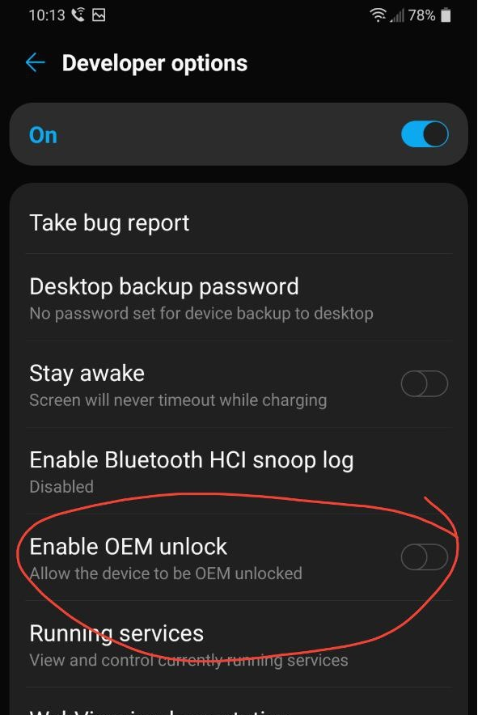
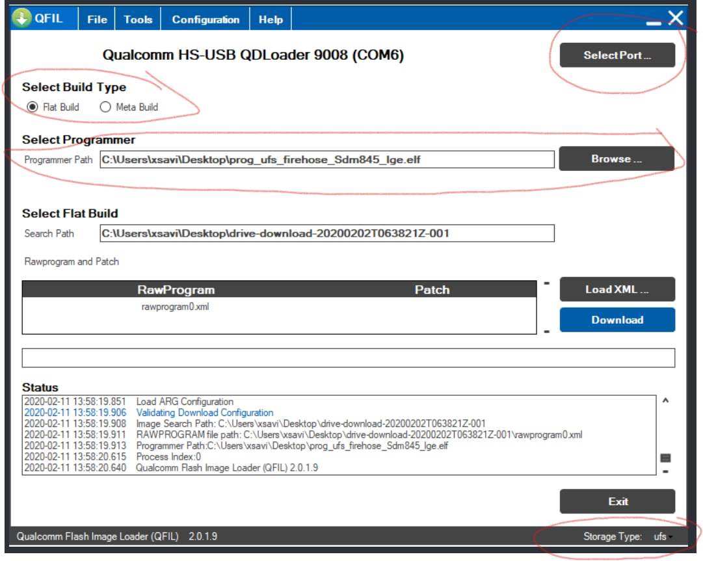
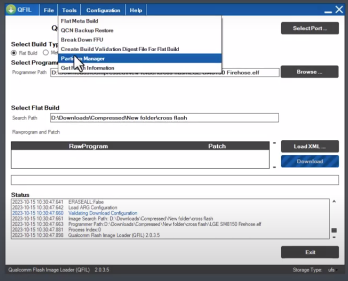
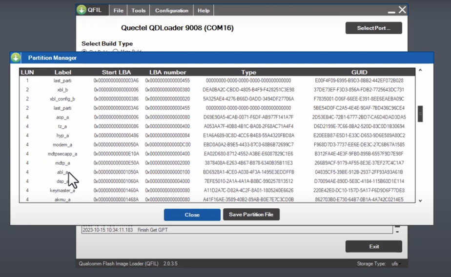
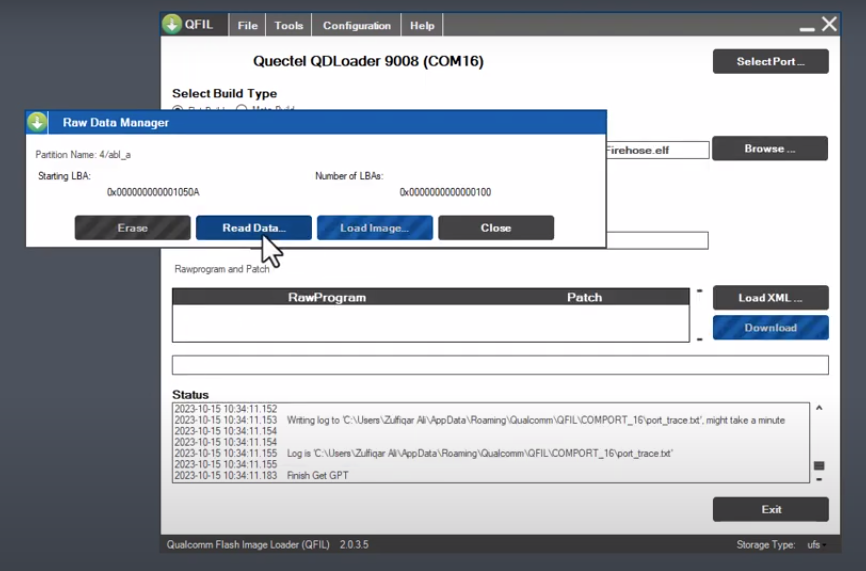
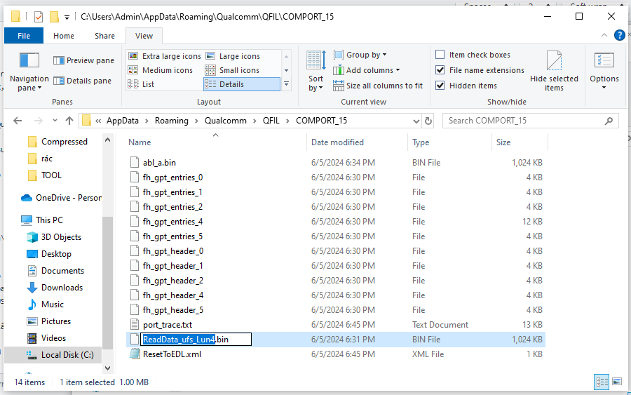
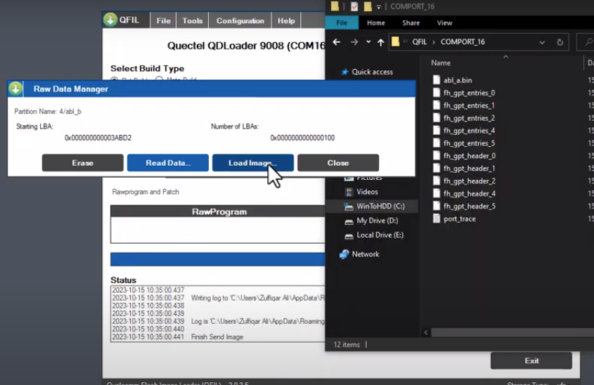
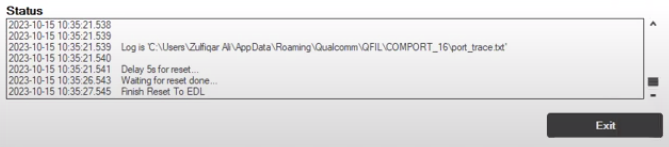
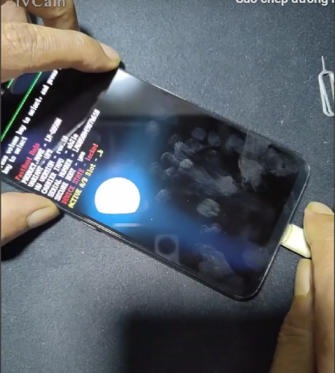

# LG V50s ThinQ 5G
Unlock Bootloader
- Bật OEM trong chế độ nhà phát triển

  
- Kết nối cáp từ điện thoại vào máy tính. Sau đó giữ nguồn và giảm âm lượng cho đến khi màn hình đen.
- Khi màn hình tắt đi, vẫn giữ Nguồn và giảm âm lượng, và đồng thời bấm tăng âm lượng liên tục.

  
- Trong Device Manager sẽ hiển thị QHSUSB_BULK hoặc Qualcomm HS-USB QLoader 9008(COMx) 

- Mở QFIL lên sau đó ở Sellect Build Type chọn Flat Build, ở Storage Type chọn ufs, Patch Programer chọn file .elf
  
- Chọn Tool chọn Partition Manager tìm abl_a và abl_b sau đó chọn ReadData... để backup

  
  
  
- Mở File Explore đường dẫn C:\Users\Username\AppData\Roaming\Qualcomm\QFIL\COMPORT# sau đó đổi tên ReadData_ufs_Lun4.bin thành abl_a.bin và tương tự abl_b cũng vậy

  
- Làm tương tự với boot_a và boot_b. Boot_a và Boot_b dành cho Magisk Root. Bỏ qua nếu bạn chỉ muốn Mở khóa Bootloader.
- Quay lại Partition Manager tìm abl_a sau đó chọn LoadImage... chọn file abl_a.bin G8X đã chuẩn bị sẵn (không phải file vừa backup) làm tương tự với abl_b
  
- Đóng Partition Manager và đợi 1 chút khi bảng STATUS hiện Finish Reset To EDL
  
- Cắm cáp giữ nút giảm âm lượng và nút nguồn tầm 7 giây thì máy khởi động lại, khi màn hình tắt thả 2 nút ra sau đó nhấn giữ nút giảm âm lượng để vào Fastboot
  
- Mở CMD sau đó nhập lệnh cd C:\Folder_của_Fastboot
- Sau đó nhập lệnh fastboot devices nếu hiện LMG850UM fastboot thì máy đã nhận fastboot
- Nhập lệnh fastboot oem unlock
- Dùng phím giảm âm để di chuyển đến dòng UNLOCK THE BOOTLOADER sau đó ấn nút nguồn là thành công
